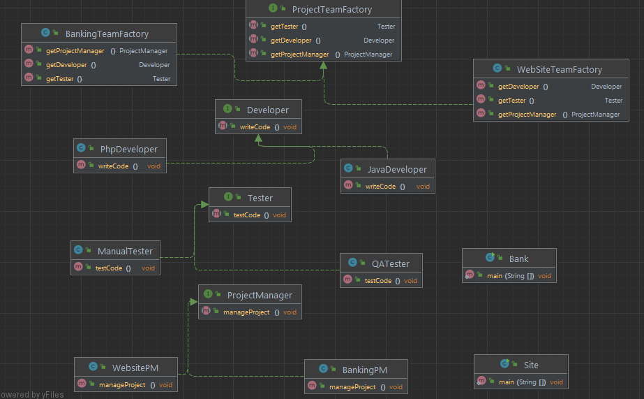
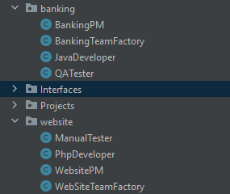

# Шаблон: Абстрактная фабрика (Abstract Factory)

## Цель

Создание интерфейса, для создания множества взаимосвязанных или взаимозависимых
объектов, бзе жесткой привязке к конкретным классам.

## Для чего используется 

Для создания множеств взаимосвязанных объектов.

## Пример использования

* Система не должна зависеть от метода создания, компоновки и представленных входящих в нее объектов;
* Входящие взаимосвязанные объекты должны использоваться вместе;
* Система должна конфигурироваться одним из множеств объектов, из которых она состоит;
* Нам необходимо предоставить множество объектов, раскрывая только их интерфейсы, но не реализацию.


Абстрактная фабрика похожа на фабричный метод, но:

    Фабричный метод используется для создания только одного продукта
    Абстрактная фабрика - это создание семейств связанных или зависимых продуктов.

Так выглядит наша диаграмма классов:


У нас есть абстрактные классы `Разработчика`, `Менеджера`, `Тестера`.
И абстрактная фабрика `ProjectTeamFactory`:
```java
/**
 * Интерфейс фабрики, которая сразу создает всю команду в числе
 * Разработчика, Менеджера и Тестера
 */
public interface ProjectTeamFactory {
    //Создает нового Разработчика
    Developer getDeveloper();
    //Создает нового Менеджера
    ProjectManager getProjectManager();
    //Создает нового Тестера
    Tester getTester();
}
```

Создаем 2 команды разработчиков

  

`banking` и `website`. В каждой команде создаем своих `Разработчика`, `Менеджера` и `Тестера`, 
реализуя эти интерфейсы:  
  
А также создаем фабрику по созданию команды:
```java
/**
 * Создаем сразу всю команду для разработки банковского приложения
 */
public class BankingTeamFactory implements ProjectTeamFactory {
    @Override
    public Developer getDeveloper() {
        return new JavaDeveloper();
    }

    @Override
    public ProjectManager getProjectManager() {
        return new BankingPM();
    }

    @Override
    public Tester getTester() {
        return new QATester();
    }
}
```

Для website будет точно также.

Теперь сделаем рабочие проекты банка и сайта:
```java
public class Bank {

    public static void main(String[] args) {
        //Создаем фабрику, для создания команды разработчиков
        ProjectTeamFactory teamFactory = new BankingTeamFactory();

        //Создаем команду
        Developer developer = teamFactory.getDeveloper();
        Tester tester = teamFactory.getTester();
        ProjectManager manager = teamFactory.getProjectManager();

        //И пусть теперь работают
        System.out.println("Creating Bank system...\n");

        developer.writeCode();
        manager.manageProject();
        tester.testCode();
    }
}
```

```java
public class Site {
    public static void main(String[] args) {
        //Создаем фабрику, для создания команды разработчиков
        ProjectTeamFactory teamFactory = new WebSiteTeamFactory();

        //Создаем команду
        Developer developer = teamFactory.getDeveloper();
        Tester tester = teamFactory.getTester();
        ProjectManager manager = teamFactory.getProjectManager();

        //И пусть теперь работают
        System.out.println("Creating website...\n");

        developer.writeCode();
        manager.manageProject();
        tester.testCode();

    }
}
```

И вот результат:

Сайт:

    Creating website...
    
    Php developer writes php code...
    Website PM manages website project...
    Manual tester tests website...

Банк:

    Creating Bank system...
    
    Java developer write Java code...
    Banking PM manages banking project...
    QA tester tests banking code...

Хотя заметим, что код один и тот же.