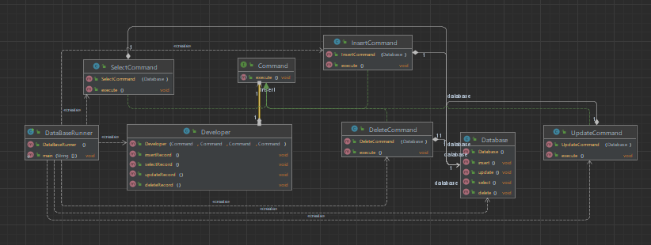

# Шаблон: Команда (Command)

## Цель 

Инкапсулирование запроса в объект.

## Для чего используется

Чтобы задать параметры клиентов для обработки определенных запросов, создание очереди из этих запросов
или их контроля и поддержки отмены операций.

## Пример использования 

* Параметризация объектов выполняемым действием;
* Определять запрос, ставить его в очередь или выполнять его в разное время;


Диаграмма:  
  

У нас есть База данных:
```java
public class Database {

    public void insert(){
        System.out.println("Inserting record...");
    }

    public void update()
    {
        System.out.println("Updating record...");
    }

    public void select()
    {
        System.out.println("Selecting record...");
    }

    public void delete()
    {
        System.out.println("Deleting record...");
    }
}
```

Но с этой базой будет работать разработчик, а не мы поэтому создадим разработчика:
```java
public class Developer {

    private Command insert;
    private Command update;
    private Command select;
    private Command delete;

    public Developer(Command insert, Command update, Command select, Command delete) {
        this.insert = insert;
        this.update = update;
        this.select = select;
        this.delete = delete;
    }

    public void insertRecord()
    {
        insert.execute();
    }

    public void updateRecord()
    {
        update.execute();
    }

    public void selectRecord()
    {
        select.execute();
    }

    public void deleteRecord()
    {
        delete.execute();
    }

}
```

`Command` - это интерфейc у которого есть только метод `execute`.  
И 4 класса, которые реализуют этот интерфейс:  
* `InsertCommand`
* `UpdateCommand`
* `SelectCommand`
* `DeleteCommand`
```java
public class InsertCommand implements Command{
    Database database;

    public InsertCommand(Database database)
    {
        this.database = database;
    }

    @Override
    public void execute() {
        database.insert();
    }
}
```
Остальные классы реализованы подобным образом.  

Теперь создадим базу и разработчика, который будет с ней работать и пусть работает:
```java
public class DataBaseRunner {
    public static void main(String[] args) {
        //Создаем базу
        Database database = new Database();

        //Создаем разработчика, который будет работать с базой данных
        Developer developer = new Developer(
                new InsertCommand(database),
                new UpdateCommand(database),
                new SelectCommand(database),
                new DeleteCommand(database)
        );

        //Разработчик работает в базой
        developer.insertRecord();
        developer.updateRecord();
        developer.selectRecord();
        developer.deleteRecord();
    }
}
```

Результат:

    Inserting record...
    Updating record...
    Selecting record...
    Deleting record...


