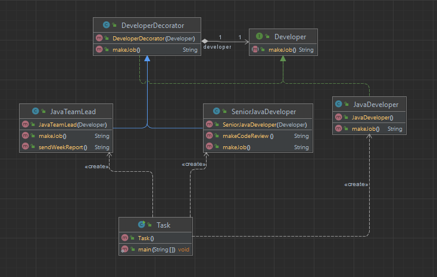

# Шаблон: Декоратор (Decorator)

## Цель

Динамическое добавление новых обязанностей объекту.

## Для чего используется 

Используется в качестве альтернативы порождению подклассов для расширения функциональности.

## Пример использования

* Динамическое и понятное клиентам добавление обязанностей объектам;
* Реализация обязанностей, которые могут быть сняты с объекта;
* Расширение класса путем порождения подклассов невозможно по каким-либо причинам.


Таким образом выглядит диаграмма классов
  

И таким образом выглядит main:
```java
public class Task {
    public static void main(String[] args) {
        //Простой разработчик
        Developer developer = new JavaDeveloper();
        System.out.println(developer.makeJob());

        //Повышаем разработчика до сеньора
        developer = new SeniorJavaDeveloper(developer);
        System.out.println(developer.makeJob());

        //Повышаем до тим лида
        developer = new JavaTeamLead(developer);
        System.out.println(developer.makeJob());

        //Создаем сразу тим лида, который умеет все
        Developer teamlead = new JavaTeamLead(new SeniorJavaDeveloper(new JavaDeveloper()));
        System.out.println(teamlead.makeJob());
    }
}
```

Результат:

    Write Java code.
    Write Java code. Make code review.
    Write Java code. Make code review. Send week report to customer.
    Write Java code. Make code review. Send week report to customer.