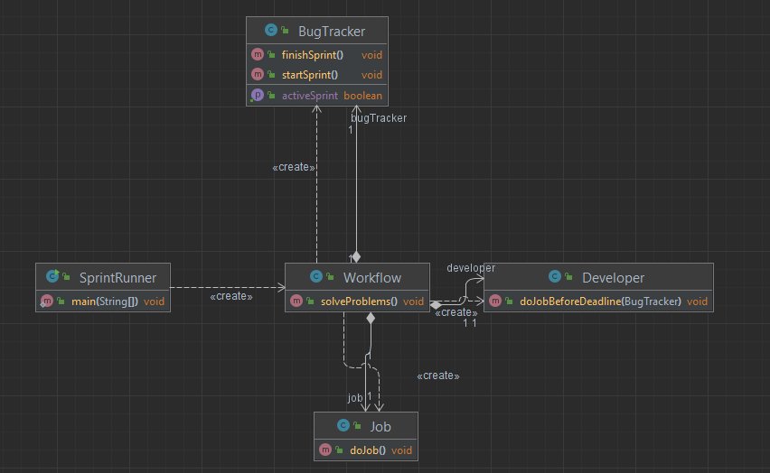

# Шаблон: Фасад (Facade)

## Цель
    
Предоставить унифицированный интерфейс вместо нескольких интерфейсов подсистемы.

## Для чего используется

Используется для определения интерфейса высокого уровня, который упрощает использование подсистемы.

## Пример использования

* Изолирование клиентов от компонентов подсистемы, упрощая работу с ней;
* Необходимость ослабления связанности подсистемы с клиентами;

В общем фасад позволяет скрыть все трудности работы системы за фасадом, и просто нажать одну кнопку,
чтобы все работало.



Вот таким образом выглядит диаграмма классов. В данном случае `Workflow` является фасадом и скрывает все возможные
трудности, которые могут быть связаны с работой с другими классами. Таким образом мы запускаем всего лишь один метод, 
грубо говоря нажимаем только на одну кнопку, чтобы все работало.

Вот так выглядит класс с функцией `main`:  
```java
public class SprintRunner {
    public static void main(String[] args) {
        Workflow workflow = new Workflow();
        //нажимаем на кнопку, чтобы все работало
        workflow.solveProblems();
    }
}
```