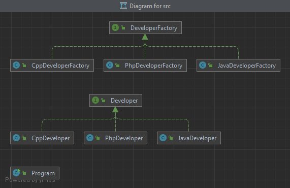

# Шаблон Фабрика (Factory Method)

## Цель  
Создание интерфейса, который создает объект. При этом, выбор того, какого класса создавать
остается за классами, которые имплементируют данный интерфейс.  

## Для чего используется  
Для делегирования создания экземпляров, другому классу.


## Пример использования 

* Заранее неизвестно, экземпляры какого класса нужно будет создать;
* Класс спроектирован таким образом, что создаваемые им объекты имеют свойства определенного класса.  

Таким образом выглядит диаграмма классов в фабричном шаблоне.
  
У нас есть Интерфейс `Разработчик (Developer)`, который умеет писать код.
От него будут наследоваться уже узконаправленные разработчики, которые умеют писать свой код.
`C++` , `Java`, `PHP`.  

Абстрактный класс
```java
public interface Developer {
    void writeCode();
}
```
C++
```java
public class CppDeveloper implements Developer{
    @Override
    public void writeCode() {
        System.out.println("C++ developer writes C++ code...");
    }
}
```
Java
```java
public class JavaDeveloper implements Developer{
    @Override
    public void writeCode() {
        System.out.println("Java developer writes Java code...");
    }
}
```
PHP
```java
public class PhpDeveloper implements Developer{
    @Override
    public void writeCode() {
        System.out.println("PHP developer writes php code.");
    }
}
```
Также у нас есть Интерфейс Фабрика  
```java
public interface DeveloperFactory {
    //Создает разработчика
    Developer createDeveloper();
}
```

И уже наследуемые от нее классы по созданию C++, Java и PHP разработчиков.  
C++
```java
public class CppDeveloperFactory implements DeveloperFactory{
    @Override
    public Developer createDeveloper() {
        return new CppDeveloper();
    }
}
```
Java
```java
public class JavaDeveloperFactory implements DeveloperFactory{
    @Override
    public Developer createDeveloper() {
        return new JavaDeveloper();
    }
}
```
PHP
```java
public class PhpDeveloperFactory implements DeveloperFactory{
    @Override
    public Developer createDeveloper() {
        return new PhpDeveloper();
    }
}
```

И вот класс главной программы:
```java
public class Program {
    public static void main(String[] args) {
        //Создаем фабрику, которая создаст разработчика указанного разработчика
        DeveloperFactory developerFactory = createDeveloperBySpeciality("php");

        //Теперь из фабрики создаем разработчика
        Developer developer = developerFactory.createDeveloper();

        //Вызываем метод писать код
        developer.writeCode();
    }


    /**
     *  Создает разработчика по указанной специальности
     *  @param speciality Специальность, по которой будет создан разработчик
     *  @return новый разработчик
     */
    static DeveloperFactory createDeveloperBySpeciality(String speciality)
    {
        //Проверяем на совпадения специальности
        if (speciality.equalsIgnoreCase("java"))
        {
            return new JavaDeveloperFactory();
        }
        else if (speciality.equalsIgnoreCase("c++"))
        {
            return new CppDeveloperFactory();
        }
        else if (speciality.equalsIgnoreCase("php"))
        {
            return new PhpDeveloperFactory();
        }
        else
        {
            throw new RuntimeException(speciality + " is unknown speciality.");
        }
    }
}
```

Здесь мы создаем фабрику, которая будет создавать разработчиков, самого разработчика с помощью фабрики, и потом он пишет
код.

    PHP developer writes php code.
