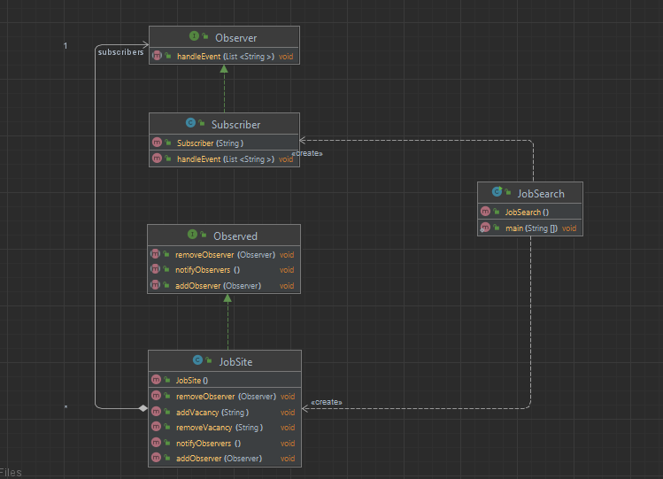

# Шаблон: Наблюдатель (Observer)

## Цель

Определение зависимости "Один ко многим" между объектами.

## Для чего используется 

Определение зависимости "Один ко многим" между объектами таким образом, что при изменении состояния одного объекта 
все зависящие от него объекты были уведомлены об этом и обновились.

## Пример использования 

* Когда у модели имеются два аспекта, один из которых зависит от другого. Инкапсулирование 
  этих аспектов в разные классы позволяют использовать их независимо друг от друга;
* Когда один объект должен оповещать другие и не делать предположений об этих объектах;
* Ослабление связи между объектами;


Диаграмма:  
  

У нас есть реализация наблюдателя в лице `Subscriber`

```java
public class Subscriber implements Observer{

    private String name;

    public Subscriber(String name) {
        this.name = name;
    }

    @Override
    public void handleEvent(List<String> vacancies) {
        System.out.println("Dear " + name + "\nWe have some changes in vacancies:\n" + vacancies +
                "\n=============================================================================\n");
    }
}
```

И реализация наблюдаемого в лице `JobSite`
```java
/**
 * Сайт с вакансиями
 */
public class JobSite implements Observed{

  //Лист с вакансиями
  List<String> vacancies = new ArrayList<>();

  //Список подписчиков на сайт
  List<Observer> subscribers = new ArrayList<>();

  /**
   * Добавляет вкансию
   * @param vacancy
   */
  public void addVacancy(String vacancy)
  {
    //Добавляем вакансию
    vacancies.add(vacancy);

    //И уведомляем всех подписчиков
    notifyObservers();
  }

  /**
   * Удаление вакансии
   * @param vacancy
   */
  public void removeVacancy(String vacancy)
  {
    //Удаляем вакансию
    vacancies.remove(vacancy);

    //Уведомляем подписчиков
    notifyObservers();
  }

  /**
   * Добавляем подписчика, которого будем уведомлять
   * @param observer Наблюдатель (подписчик)
   */
  @Override
  public void addObserver(Observer observer) {
    subscribers.add(observer);
  }

  /**
   * Удаляем подписчика
   * @param observer Наблюдатель
   */
  @Override
  public void removeObserver(Observer observer) {
    subscribers.remove(observer);
  }

  /**
   * Уведомление подписчиков об изменениях
   */
  @Override
  public void notifyObservers()
  {
    //Проходим по всем подписчикам
    for (Observer observer: subscribers)
    {
      //И вызываем у них метод обработки события
      observer.handleEvent(vacancies);
    }
  }
}
```

Main:
```java
public class JobSearch {
  public static void main(String[] args) {
    //Создаем сайт вакансий
    JobSite site = new JobSite();

    //Добавляем вакансии
    site.addVacancy("First Position");
    site.addVacancy("Second Position");


    //Создаем подписчиков
    Observer firstSub = new Subscriber("Sorokin A.E.");
    Observer secondSub = new Subscriber("Ivanov A.Y.");

    //Добавляем подписчиков на сайт
    site.addObserver(firstSub);
    site.addObserver(secondSub) ;

    //Теперь добавляем еще одну вакансию
    site.addVacancy("Third Position");

    //А теперь удалим вакансию
    site.removeVacancy("First Position");
  }
}
```
Результат:  
После добавления вакансии

    Dear Sorokin A.E.
    We have some changes in vacancies:
    [First Position, Second Position, Third Position]
    =============================================================================
    
    Dear Ivanov A.Y.
    We have some changes in vacancies:
    [First Position, Second Position, Third Position]
    =============================================================================
    
И еще сообщения после удаления вакансии

    Dear Sorokin A.E.
    We have some changes in vacancies:
    [Second Position, Third Position]
    =============================================================================
    
    Dear Ivanov A.Y.
    We have some changes in vacancies:
    [Second Position, Third Position]
    =============================================================================